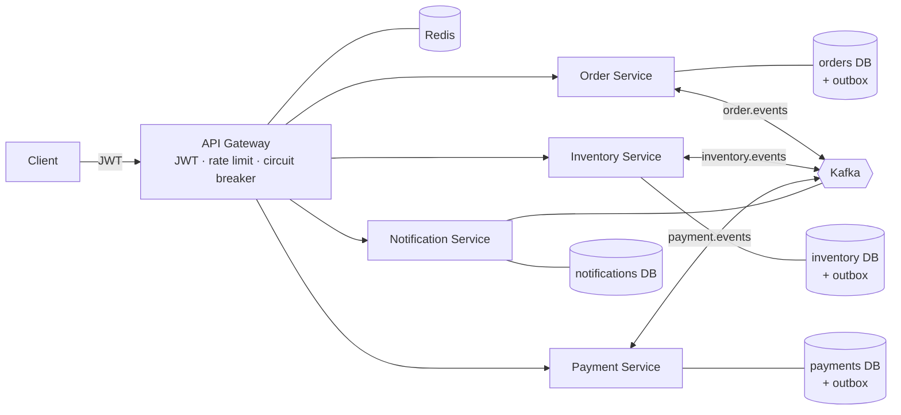
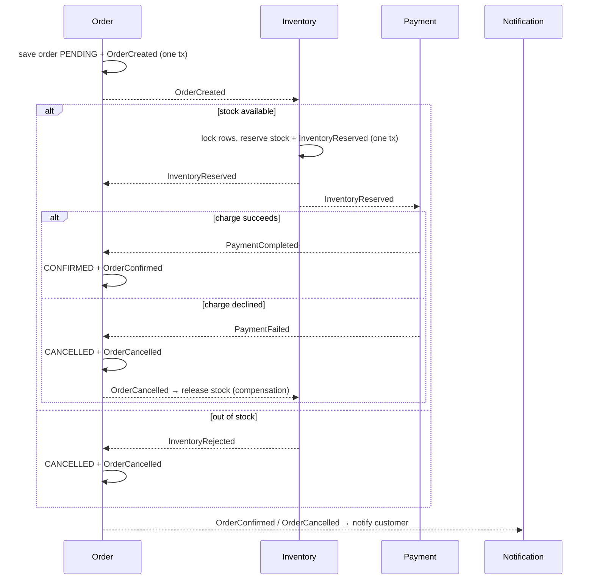

# OrderStream — Event-Driven E-Commerce Microservices

   

Order, inventory, payment and notification services that coordinate a distributed transaction with the **Saga pattern over Kafka**, using a **transactional outbox** for reliable publishing and **idempotent consumers** for exactly-once *effects* on top of at-least-once delivery. A **JWT-secured Spring Cloud Gateway** fronts the system with **Redis rate limiting** and **Resilience4j circuit breakers**. Every service is tested against real Postgres/Kafka/Redis with **Testcontainers** and ships with Docker and **Kubernetes** manifests.

**Tech:** Java 17 · Spring Boot 3 · Spring Cloud Gateway · Kafka · PostgreSQL · Redis · Resilience4j · Flyway · Testcontainers · Docker · Kubernetes

## Architecture



Each service owns its database (database-per-service) and publishes to exactly one topic. Messages are keyed by order id, so all events for an order stay on one partition and in order.

## The order saga



| Order status | Meaning |
|---|---|
| `PENDING` | Created, waiting for inventory |
| `INVENTORY_RESERVED` | Stock held, waiting for payment |
| `CONFIRMED` | Paid (terminal) |
| `CANCELLED` | Rejected by inventory or payment; reserved stock released (terminal) |

## Reliability design

**Transactional outbox** (`common/.../outbox`). A service never calls Kafka inside a business transaction. It writes the state change and an `outbox_events` row in the same local transaction, and `OutboxRelay` publishes pending rows afterwards. If the database commit fails, no event exists; if Kafka is down, events wait in the table. The relay locks rows with `FOR UPDATE SKIP LOCKED`, so multiple replicas can run it safely.

**Idempotent consumers** (`common/.../idempotency`). The relay is at-least-once, so duplicates are expected. The outbox row id becomes the event id, which stays the same across re-deliveries. Each consumer records `(event_id, consumer)` in `processed_events` in the same transaction as its side effects; a duplicate is skipped, and a concurrent duplicate fails on the primary key and rolls back. Business-level guards add a second layer (one payment per order, one reservation set per order, terminal order states are final).

**Failure handling.** Listener errors retry with exponential back-off, then go to `<topic>.DLT`. Malformed messages skip retries and go straight to the DLT. Order state transitions tolerate out-of-order arrival across topics (e.g. `PaymentCompleted` before `InventoryReserved`).

**Concurrency.** Inventory locks product rows with `PESSIMISTIC_WRITE` in sorted SKU order to prevent overselling and deadlocks; reservations are all-or-nothing.

**Edge.** The gateway validates HS256 JWTs, strips any client-supplied `X-User-Id`, and sets it from the verified subject. Downstream services trust only that header. A Redis token bucket limits each user (or IP for anonymous calls), and per-route circuit breakers with 5s timeouts fail fast to a `503` fallback.

## Project layout

```
common/                shared event contracts, outbox, idempotency, Kafka config
order-service/         :8081  orders + saga coordination
inventory-service/     :8082  stock reservations + compensation
payment-service/       :8083  charges (simulated provider)
notification-service/  :8084  customer notifications
api-gateway/           :8080  JWT, rate limiting, circuit breakers, routing
k8s/                   Kustomize manifests (infra + services, probes, HPA)
docker-compose.yml     full local stack
```

## Running locally

Prerequisites: Docker. For running tests outside Docker: JDK 17 and Maven 3.9+.

```bash
docker compose up --build -d
./scripts/demo.sh          # happy path + compensation path end to end
```

Or by hand:

```bash
TOKEN=$(curl -s -X POST localhost:8080/auth/token -H 'Content-Type: application/json' \
  -d '{"username":"souvik"}' | jq -r .accessToken)

curl -X POST localhost:8080/api/orders -H "Authorization: Bearer $TOKEN" \
  -H 'Content-Type: application/json' \
  -d '{"items":[{"productId":"SKU-KEYBOARD","quantity":1,"unitPrice":79.99}]}'

curl localhost:8080/api/orders -H "Authorization: Bearer $TOKEN"
curl localhost:8080/api/inventory/products
curl localhost:8080/api/notifications -H "Authorization: Bearer $TOKEN"
```

Seeded SKUs: `SKU-KEYBOARD`, `SKU-MOUSE`, `SKU-MONITOR`, `SKU-HEADSET`, `SKU-LAPTOP`. The simulated payment provider declines charges above `PAYMENT_MAX_CHARGE` (default 5000.00), which makes it easy to trigger the compensation path.

> `/auth/token` is a demo-only token issuer. In production, remove it and point the resource server at a real identity provider.

## API

| Method | Path | Auth | Description |
|---|---|---|---|
| POST | `/auth/token` | – | Issue a demo JWT |
| POST | `/api/orders` | JWT | Place an order (returns `202 Accepted`) |
| GET | `/api/orders` | JWT | List my orders |
| GET | `/api/orders/{id}` | JWT | Get one of my orders |
| GET | `/api/inventory/products[/{sku}]` | – | Browse stock |
| POST | `/api/inventory/products/{sku}/restock` | JWT | Add stock |
| GET | `/api/payments/order/{orderId}` | JWT | Payment for my order |
| GET | `/api/notifications` | JWT | My notifications |

## Tests

```bash
mvn verify
```

Integration tests start real PostgreSQL, Kafka and Redis containers via Testcontainers and cover: outbox publication to Kafka, duplicate delivery producing a single effect in every consumer, payment failure triggering cancellation and compensation, stock release on cancellation, all-or-nothing reservation, JWT rejection, circuit-breaker fallback, and rate limiting. CI runs the same suite on every push.

## Kubernetes

```bash
# build images into your cluster's registry (or `minikube image load` / `kind load docker-image`)
for s in order-service inventory-service payment-service notification-service api-gateway; do
  docker build --build-arg SERVICE=$s -t orderstream/$s:latest .
done
kubectl apply -k k8s/
kubectl -n orderstream get pods
```

Services use Spring Boot liveness/readiness probes, resource requests/limits and multiple replicas (safe thanks to `SKIP LOCKED` outbox relaying and Kafka consumer groups); the gateway has an HPA. The in-cluster Postgres/Kafka/Redis are single-node and meant for development; use managed services or operators (e.g. Strimzi) in production, and replace the dev secret.
